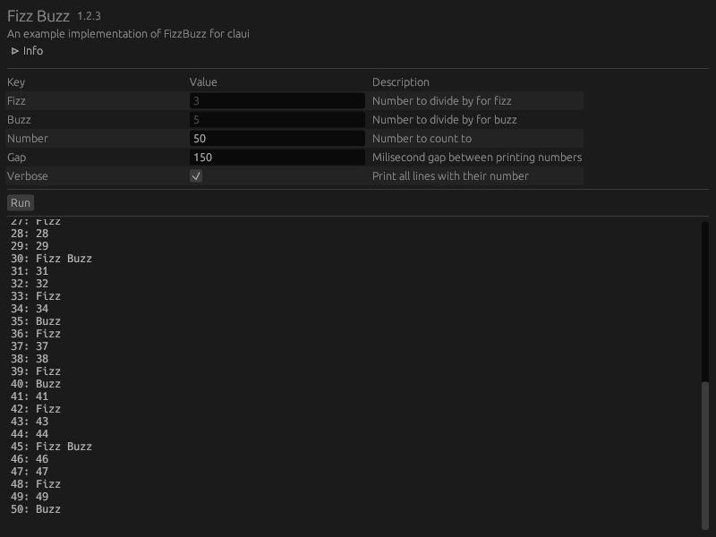

+++
title = "Grant Handy"
description = "I'm an open-source programmer and a student, currently living in Incheon, South Korea."
extra.cover = "https://avatars.githubusercontent.com/u/45475651?v=4"
+++

## Articles

### [A First-Person Game in 2KB](./raycasting/)
Create a tiny game in 2KB with Rust and WASM-4.

## Notable Projects

### Ipmap ([repo](https://github.com/grantshandy/ipmap))
A desktop app for observing all the servers your computer connects to.

### WASM-4 Playground ([site](https://grantshandy.github.io/wasm4-playground))
A website for writing and playing [WASM-4](https://wasm4.org) retro games in the browser with [AssemblyScript](https://assemblyscript.org).

### Force Directed Graph ([repo](https://github.com/grantshandy/fdg))
A [force-directed graph drawing](https://en.wikipedia.org/wiki/Force-directed_graph_drawing) library for [petgraph](https://lib.rs/crates/petgraph).

### Claui ([repo](https://github.com/grantshandy/claui))
An automatic [GUI](https://en.wikipedia.org/wiki/Graphical_user_interface) generator for [clap](https://lib.rs/crates/clap) [CLI](https://en.wikipedia.org/wiki/Command-line_interface) applications.

### Egui Themer ([repo](https://github.com/grantshandy/egui-themer))
A graphical tool for interactively designing compile-time [egui](https://lib.rs/crates/egui) themes.

