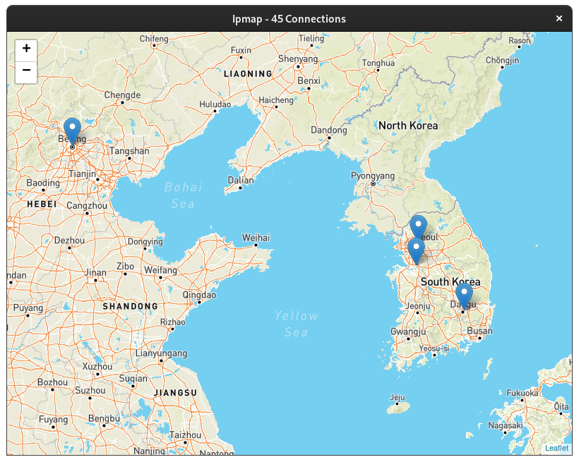

+++
title = "Project Showcase"
+++

Here's a short list of some of the more complete things I've put on the internet.

## Artist Constellations

[artist-constellations.art](https://github.com/grantshandy/artist-constellations.art) is a website which allows you to explore your (and your friend's) Spotify artists in 3D constellations. The site is currently down as I'm working on a new version.

## WASM-4 Playground

[WASM-4 Playground](https://grantshandy.github.io/wasm4-playground) is a website which allows you to write small [WASM-4](https://wasm4.org) games with [AssemblyScript](https://assemblyscript.org) completely in the browser.

## Egui Themer

[egui-themer](https://github.com/grantshandy/egui-themer) is a graphical tool for interactively designing zero overhead compile-time [egui](https://egui.rs) themes.

## Ipmap

[ipmap](https://github.com/grantshandy/ipmap) is a desktop app for observing where the other servers your computer has connected to are located.

## fdg (Force Directed Graph)

[`fdg`](https://github.com/grantshandy/fdg) is a library for drawing and manipulating images of graphs.

## Claui

[`claui`](https://github.com/grantshandy/claui) is a library that automatically generates graphical interfaces from [`clap`](https://github.com/clap-rs/clap) command line applications.

## Gbrowse

[gBrowse](https://github.com/grantshandy/gbrowse) is an experimental browser for the gemini protocol.

## Gemway

[Gemway](https://github.com/grantshandy/gemway) is a HTTP-Gemini proxy styled like a LaTeX document.