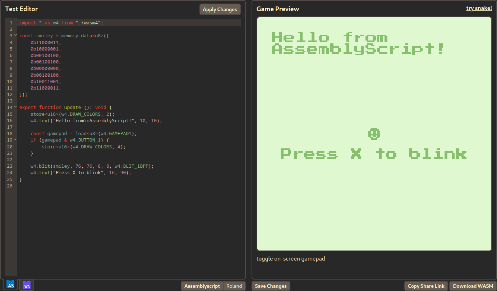
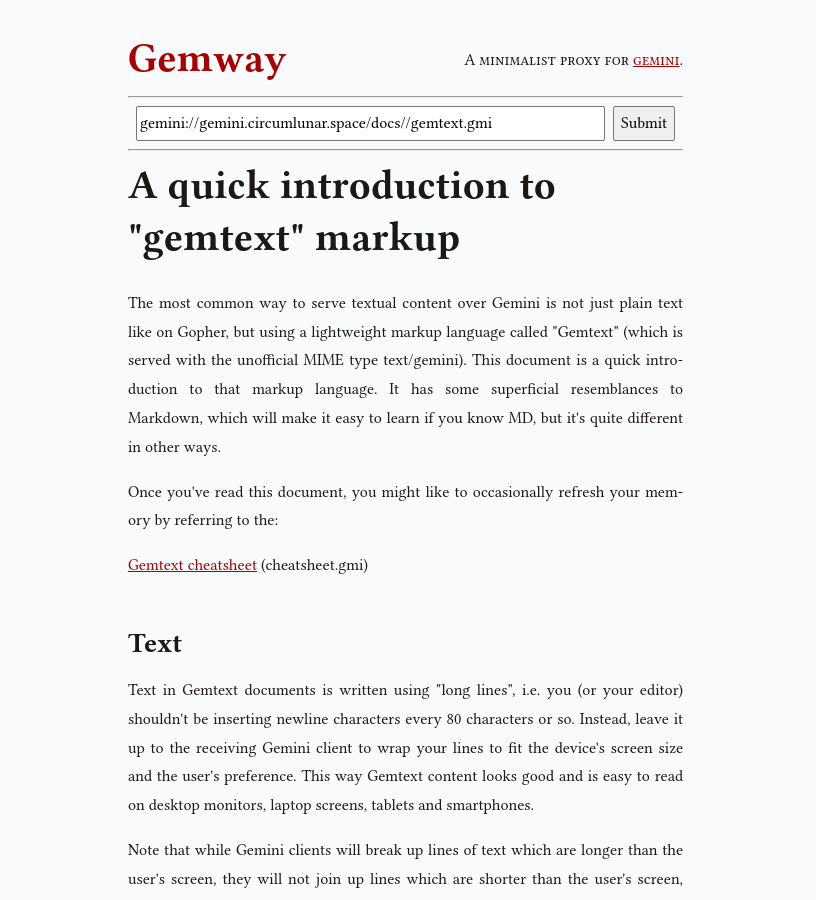
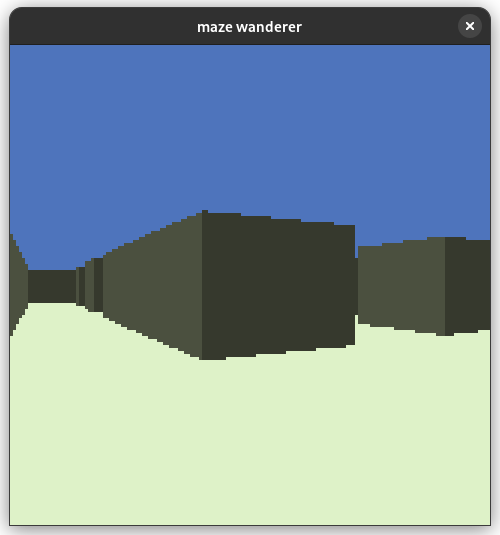
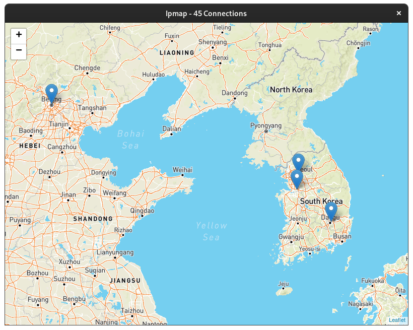
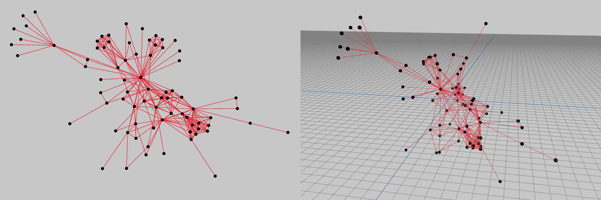
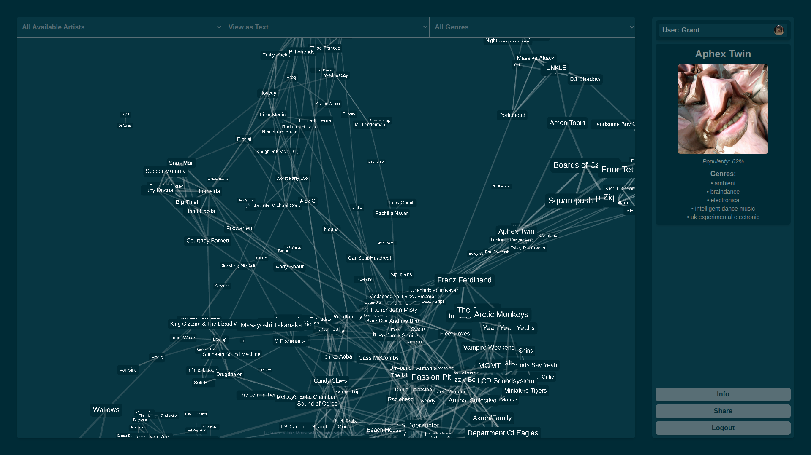
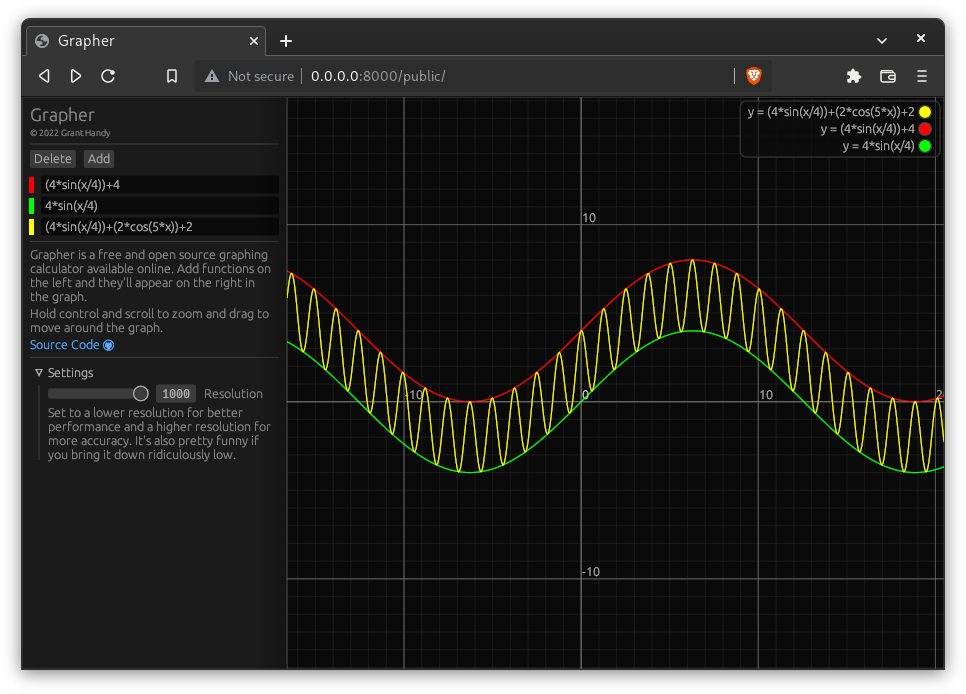
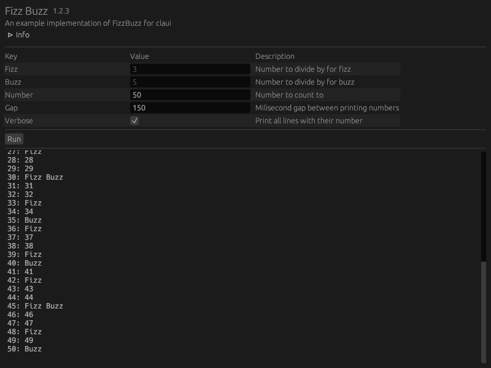
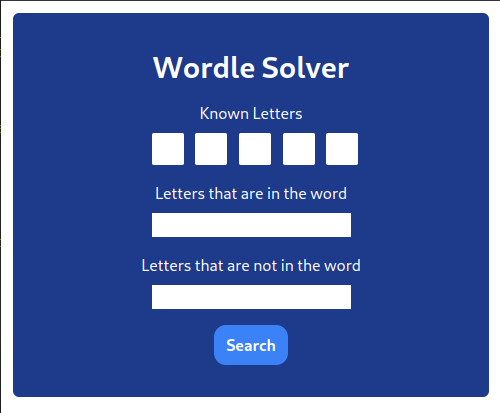

+++
title = "Showcase"
+++

## Wasm4 Playground

Wasm4 Playground is a website that allows you to write, play, and share [WASM-4](https://wasm4.org) retro games.
The site works by bundling the [AssemblyScript](https://assemblyscript.org) and [Roland](https://github.com/DenialAdams/roland)
compilers which compile your source code into portable `.wasm` files.
The site then runs your game in a modified version of the WASM-4 runtime which automatically reloads when you click "Apply Changes".



[View Github Page](https://github.com/grantshandy/wasm4-playground)
[Visit Site](https://grantshandy.github.io/wasm4-playground)

## Gemway

Gemway is a little HTTP-[Gemini](https://en.wikipedia.org/wiki/Gemini_(protocol)) proxy I threw together in a night.
Though it's a little rough around the edges, I think the LaTeX style is nice.
It translates HTTP requests into Gemini requests on the backend and returns a nicely formatted HTML document with translated links.



[View Github Page](https://github.com/grantshandy/gemway)

## Maze Wanderer

Maze Wanderer is a first-person "walking simulator" for the [WASM-4](https://wasm4.org) retro game engine.
I wrote this game to learn about raycasting, the method used to create pseudo-3D games before computers had 3D acceleration.
The particular algorithm for raycasting took me quite a while to get right, it might be the subject of
a future blog post on this site.



[View Github Page](https://github.com/grantshandy/maze-wanderer)
[Play Online](https://wasm4.org/play/maze-wanderer)

## Ipmap

Ipmap is a desktop program that shows the locations of all of the servers that your computer has connected to.
It's fascinating to see that your computer regularly receives information from the other side of the world.
Ipmap works by capturing all incoming packets with [`libpcap`](https://www.tcpdump.org/), then sending the packet's source IP address off to an
ip-geolocation REST API. Once it gets the response, it simply puts it on the map with some metadata in a context menu.

Unlike other desktop applications with web frontends,
Ipmap is a tiny Rust executable that uses your operating system's preinstalled webview library.



[View Github Page](https://github.com/grantshandy/ipmap)

## fdg (Force-Directed Graph)

fdg is a [force-directed graph drawing](https://en.wikipedia.org/wiki/Force-directed_graph_drawing) framework for Rust.
It's very primitive in comparison to something like [gephi](https://gephi.org/) or [graphia](https://graphia.app/),
but it works well to very quickly visualize small Rust [`petgraph`](https://crates.io/crates/petgraph) datasets.

fdg is designed to be as flexible as possible.
It supports [custom forces](https://docs.rs/fdg-sim/latest/fdg_sim/force/struct.Force.html) as well as rendering graphs to
[svg](https://crates.io/crates/fdg-img), [HTML canvas](https://www.npmjs.com/package/fdg-wasm), or [interactive windows](https://crates.io/crates/fdg-macroquad).



[View Github Page](https://github.com/grantshandy/fdg)
[View Documentation](https://docs.rs/fdg-sim)

## [artist-constellations.art](https://artist-constellations.art)

Artist Constellations is a website that lets you view and shares the artists you listen to on Spotify in a giant
[graph](<https://en.wikipedia.org/wiki/Graph_(discrete_mathematics)>).

- Filter by your most listened artists of certain time periods, or by individual genres.
- View artists by their names, profile pictures, or just simple dots.
- Share your artists with your friends and see who you have in common and where your tastes intersect.

_This site is currently being rewritten in Svelte with a more friendly user interface._



[View Github Page](https://github.com/grantshandy/artist-constellations.art)
[Visit Site](https://artist-constellations.art)

## Grapher

Grapher is a very simple graphing calculator that works as a native desktop application and a website.



[View Github Page](https://github.com/grantshandy/grapher)
[Visit Site](<https://grantshandy.github.io/grapher/#(4*sin(x/4))+4,4*sin(x/4),(4*sin(x/4))+(2*cos(5*x))+2>)

## Claui

Claui is a Rust library that generates convenient GUIs for your [`clap`](https://crates.io/crates/clap)-based command-line applications.
Claui was designed to be as simple and easy to use as possible. In many cases, you can drop it into already-written `clap` programs and get a high-quality GUI.

```rust
// simply declare your program's parameters with clap

claui::run(app, |matches| {
  // then run your application here!
});

// no other configuration is needed!
```

Here's an example of the famous [Fizz Buzz](https://en.wikipedia.org/wiki/Fizz_buzz) program.



[View Github Page](https://github.com/grantshandy/claui)
[View Documentation](https://docs.rs/claui)

## Wordle Solver

This is a simple program that I few together in an hour or two after being frustrated with [wordle](https://www.nytimes.com/games/wordle/index.html).



[View Github Page](https://github.com/grantshandy/wordle-solver)
[Visit Site](https://grantshandy.github.io/wordle-solver/)

## libretranslate-rs

[LibreTranslate](https://libretranslate.org) is a web frontend and API for [Argos Translate](https://github.com/argosopentech/argos-translate/),
an open-source translation library.
`libretranslate-rs` is the "official" Rust library for accessing the libretranslate API.
`libretranslate-rs` can translate between English, Arabic, Chinese, French, German, Italian, Japanese, Portuguese, Russian, and Spanish.

[View Github Page](https://github.com/grantshandy/libretranslate-rs)
[View Documentation](https://docs.rs/libretranslate)

